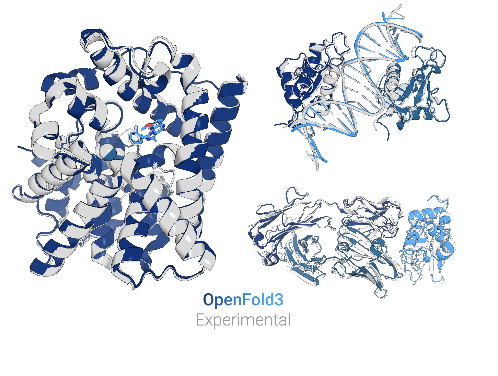

_Figure: Comparison of OpenFold and experimental structures on 5sgz (left), 3hfm (bottom right), 7ogs (top right)._

# OpenFold3

A biological structure prediction model based on DeepMind's 
[AlphaFold 3](https://github.com/deepmind/alphafold3). Developed under a fully open source (Apache 2) license.

## Features

OpenFold3 replicates the full set of input features described in the [*AlphaFold 3*](https://www.nature.com/articles/s41586-024-07487-w) publication. 

A summary of the features supported include:
- Structure prediction of protein, small molecule, RNA, and DNA. Includes support for non-canonical residues.
- A pipeline for generating MSAs using the [ColabFold server](https://github.com/sokrypton/ColabFold) or using JackHMMER / hhblits following the AlphaFold3 protocol.
- Template support for predictions
- Support for using [CuEquivariance kernels](https://docs.nvidia.com/cuda/cuequivariance) - more details here (TODO: Link to kernels page on documentation)
- Support for distributed predictions across multiple GPUs (TODO: Add refs)

## Quick-Start for Inference

Make your first predictions with OpenFold3 in a few easy steps:

1. Install Openfold
`conda install ...`

2. Run your first prediction

```
python run_openfold.py predict --query_json=examples/ubiquitin_query.json
```

TODO: Add ubiqutin_query.json to the examples directory.

More information on how to customize your inference prediction can be found at our documentation home at https://openfold3.readthedocs.io/en/latest/ More examples for inputs and outputs can be found at (TODO: Add hugging face examples directory here)

## Benchmarking

TBD, or removed if not included on first version

## Documentation

Please visit our documentation at https://openfold3.readthedocs.io/en/latest/

## Contributing

If you encounter problems using OpenFold3, feel free to create an issue! We also
welcome pull requests from the community.

## Citing this Work

Please cite our paper:

TODO: Include citation to whitepaper

Any work that cites OpenFold should also cite [AlphaFold3](https://www.nature.com/articles/s41586-024-07487-w).
