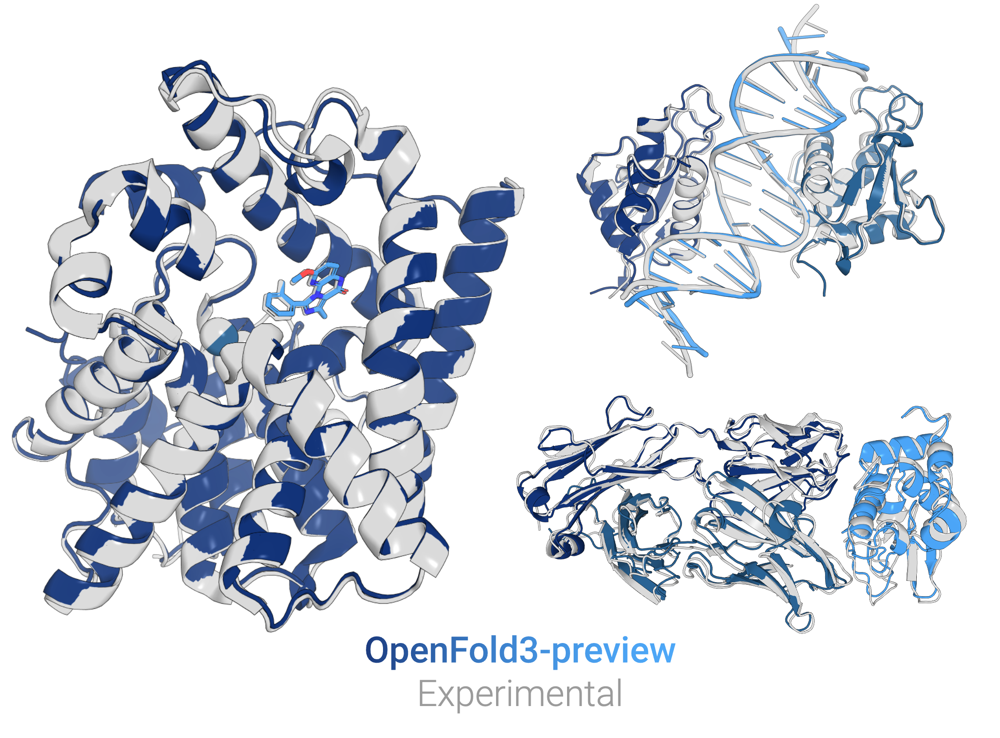

# OpenFold3-preview
<picture>
  <source media="(prefers-color-scheme: dark)" srcset="imgs/predictions_combined_dark.png">
  <source media="(prefers-color-scheme: light)" srcset="imgs/predictions_combined_light.png">
  
</picture>

OpenFold3 is a biomolecular structure prediction model aiming to be a bitwise reproduction of DeepMind's 
[AlphaFold3](https://github.com/deepmind/alphafold3), developed by the AlQuraishi Lab at Columbia University and the OpenFold consortium. This research preview is intended to gather community feedback and allow developers to start building on top of the OpenFold ecosystem. The OpenFold project is committed to long-term maintenance and open source support, and our repository is freely available for academic and commercial use under the Apache 2.0 license.

For our reproduction of AlphaFold2, please refer to the original [OpenFold repository](https://github.com/aqlaboratory/openfold).

## Features

OpenFold3-preview replicates the input features described in the [AlphaFold3](https://www.nature.com/articles/s41586-024-07487-w) publication, as well as batch job support and efficient kernel-accelerated inference.

A summary of our supported features includes:
- Structure prediction of standard and non-canonical protein, RNA, and DNA chains, and small molecules
- Pipelines for generating MSAs using the [ColabFold server](https://github.com/sokrypton/ColabFold) or using JackHMMER / hhblits following the AlphaFold3 protocol
- [Structure templates](https://openfold-3.readthedocs.io/en/latest/template_how_to.html) for protein monomers
- Kernel acceleration through [cuEquivariance](https://docs.nvidia.com/cuda/cuequivariance) and [DeepSpeed4Science](https://www.deepspeed.ai/tutorials/ds4sci_evoformerattention/) kernels - more details [here](https://openfold-3.readthedocs.io/en/latest/kernels.html)
- Support for [multi-query jobs](https://openfold-3.readthedocs.io/en/latest/input_format.html) with [distributed predictions across multiple GPUs](https://openfold-3.readthedocs.io/en/latest/inference.html#inference-run-on-multiple-gpus)
- Custom settings for [memory constrained GPU resources](https://openfold-3.readthedocs.io/en/latest/inference.html#inference-low-memory-mode)

## Quick-Start for Inference

Make your first predictions with OpenFold3-preview in a few easy steps:


1. Install OpenFold3-preview using our pip package
```bash
pip install openfold3 
mamba install kalign2 -c bioconda
```

2. Setup your installation of OpenFold3-preview and download model parameters:
```bash
setup_openfold
```

3. Run your first prediction using the ColabFold MSA server with the `run_openfold` binary

```bash
run_openfold predict --query_json=examples/example_inference_inputs/ubiquitin_query.json
```

More information on how to customize your inference prediction can be found at our documentation home at https://openfold-3.readthedocs.io/en/latest/. More examples for inputs and outputs can be found at (TODO: Add hugging face examples directory here)

## Benchmarking

OpenFold3-preview performs competitively with the state of the art in open source protein structure prediction, while being the only model to match AlphaFold3 on monomeric RNA structures.

**Preliminary results:**

<picture>
  <source srcset="imgs/protein_plot.png">
  
</picture>
Figure 1. Performance of OF3p and other models on protein monomers and complexes. A) Predictions on the CASP16 protein monomer set. B) Predictions on protein-protein complexes sourced from CASP16, [FoldBench](https://www.biorxiv.org/content/10.1101/2025.05.22.655600v1), and the original antibody-antigen test set of AF3. For FoldBench and AbAg set, report performance at the interface level, whereas for CASP16, we aggregate results over all interfaces in a given structure. For AbAg complexes, we predicted more than 5 seeds for each structure and so to emulate the 5 seed performance we randomly sampled a set of 5 seeds and used those structures for oracle and ranked performance.
<br><br><br>

<picture>
  <source srcset="imgs/rna_large.png">
  
</picture>
Figure 2. Performance of OF3p and other models on RNA benchmarks. A) Performance on CASP16  RNA monomers (left) and the [Ludaic & Elofsson  RNA monomer set](https://www.biorxiv.org/content/10.1101/2025.04.30.651414v1) (right). B) and C) Example predicted structures aligned to the ground truth (grey) for entry R1241 (group II intron). D) RNA MSAs improve the performance of certain predictions compared to baselines without RNA MSAs on the Ludaic & Elofsson RNA set. E) 8TJU with MSA features. F) 8TJU without MSA features.

<br><br><br>

<picture>
  <source srcset="imgs/protein_ligand_plot.png">
  
</picture>
Figure 3. Performance of OF3p and other models on [Runs N’ Poses](https://www.biorxiv.org/content/10.1101/2025.02.03.636309v1), a diverse set of protein-ligand complexes. In this comparison, we report AF3 performance with the use of structural templates.


## Documentation
Please visit our full documentation at https://openfold-3.readthedocs.io/en/latest/

## Upcoming
The final OpenFold3 model is still in development, and we are actively working on the following features:
- Full parity on all modalities with AlphaFold3
- Training documentation & dataset release
- Workflows for training on custom non-PDB data

## Contributing

If you encounter problems using OpenFold3, feel free to create an issue! We also
welcome pull requests from the community.

## Citing this Work

Any work that cites OpenFold should also cite [AlphaFold3](https://www.nature.com/articles/s41586-024-07487-w).
