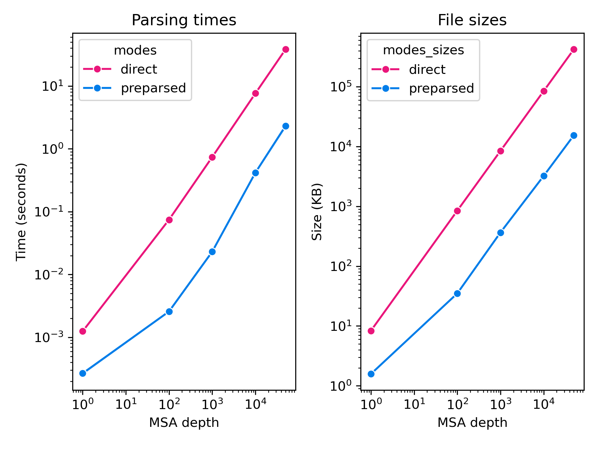

# Understanding Precomputed MSA Handling

Here, we aim to provide additional explanations for the inner workings of the MSA components of the OF3 inference pipeline. If you need step-by-step instructions on how to generate MSAs using our OF3-style pipeline, refer to our [MSA Generation](msa_generation_how_to.md) document. If you need a guide on how to interface MSAs with the inference pipeline, go to the [Precomputed MSA How-To Guide](precomputed_msas_how_to.md).

Specifically, we detail:
1. [MSA Input Feature Components](precomputed_msa_explanation.md#1-msa-input-feature-components)
2. [MSASettings](precomputed_msa_explanation.md#2-msasettings)
3. [Online Cross-Chain Pairing in OF3](precomputed_msa_explanation.md#3-online-msa-pairing)
4. [Chain Deduplication Utility](precomputed_msa_explanation.md#4-chain-deduplication-utility)
5. [Preparsing MSAs into NPZ](precomputed_msa_explanation.md#5-preparsing-raw-msas-into-npz-format)

## 1. MSA Input Feature Components

Based on the AF3 and AF2-Multimer Supplementary Materials, MSA input features for a single chain are composed of up to 3 components:

1. **query sequence**: the protein or RNA sequence whose structure is to be predicted
2. **paired rows**: derived from designated MSAs by putting sequences originating from identical species in the same rows 
3. **unpaired rows**: derived from MSAs by vertically concatenating aligned sequences from all desired sequence database searches; we term the vertical stack of such MSAs the *main MSA* of the corresponding chain

For multimeric queries, the MSA features for all chains are concatenated horizontally.


*Components of OF3 Input MSA features. (left) 5TDH - G protein heterotrimer with GDP, light blue segments indicate gapped parts in the paired MSA, black segments indicate masked parts; (middle) 1OGH - dCTP deaminase homotrimer; 1X1R - M-Ras in complex with GDP and Zn*

As shown in the figure above, paired MSAs are only provided for protein chains that are part of complexes with at least **two unique protein chains**. Besides the query sequences, protein chains in monomeric and homomeric assemblies and RNA chains only get main MSA features, which are treated as implicitly paired for homomers. MSA feature columns for DNA and ligand tokens are empty and masked to prevent their contributions to model activations.

## 2. MSASettings

This section will add some clarifying points about MSASettings.

The 3 main settings to update are:
1. *max_seq_counts*: A dictionary specifying how many sequences to read from each MSA file with the associated name. MSA files whose names are not provided in this dictionary *will not be parsed*. For example, if one wants `uniparc_hits.a3m` MSA files to be parsed, the following field should be specified:

```
dataset_config_kwargs:
  msa:
    max_seq_counts:  
      uniprot_hits: 50000
      mgnify_hits: 5000
      custom_database_hits: 10000
```

where up to the first 10000 sequences will be read from each `uniparc_hits.a3m` file.

2. *msas_to_pair*: The list of MSA filenames that contain species information that can be used for online pairing. See the [Online MSA Pairing](precomputed_msas.md#6-online-msa-pairing-from-precomputed-msas) section for details.

3. *aln_order*: The order in which to vertically concatenate MSA files for each chain for main MSA features. MSA files whose names are not provided in this list *will not be used*. For example, if one has MSA files named `mgnify_hits`, `uniprot_hits` and `uniparc_hits` and want to vertically concatenate them for each chain in this order, they should update the `runner.yml` as follows:

```
dataset_config_kwargs:
    aln_order:   
      - uniprot_hits
      - mgnify_hits
      - custom_database_hits
```

## 3. Online MSA pairing

This section will contain details on the workings/behavior of our online MSA pairing algorithm. Provided in the next internal release.

By default, the OF3 MSA pipeline uses the UniProt MSAs for online pairing.

TODO: add uniprot sequence header explanation

This formatting requirement originates from our OF3 MSA generation pipeline running jackhmmer to search sequences against UniProt and us using UniProt MSAs for cross-chain pairing as per the AF3 SI. An example `sto` format is:

```
# STOCKHOLM 1.0

#=GS sp|P53859|CSL4_YEAST/1-292               DE [subseq from] Exosome complex component CSL4 OS=Saccharomyces cerevisiae (strain ATCC 204508 / S288c) OX=559292 GN=CSL4 PE=1 SV=1
#=GS tr|A6ZRL0|A6ZRL0_YEAS7/1-292             DE [subseq from] Conserved protein OS=Saccharomyces cerevisiae (strain YJM789) OX=307796 GN=CSL4 PE=4 SV=1
#=GS tr|C7GPC7|C7GPC7_YEAS2/1-292             DE [subseq from] Csl4p OS=Saccharomyces cerevisiae (strain JAY291) OX=574961 GN=CSL4 PE=4 SV=1
... rest of the metadata field ...

5k36_I                                           GDPHMACNFQFPEIAYPGKLICPQY--G---------T--E-NK-D-G-------E-D--IIFNYVPGPGTKL----IQ---Y----E--------H---N--G---RT-------------LEAITATL-VGTV-RC---E--E----E----K--KT-DQ-E--E---E---R--EGT-D----Q-S-T--E--E-E-
sp|P53859|CSL4_YEAST/1-292                       ----MACNFQFPEIAYPGKLICPQY--G---------T--E-NK-D-G-------E-D--IIFNYVPGPGTKL----IQ---Y----E--------H---N--G---RT-------------LEAITATL-VGTV-RC---E--E----E----K--KT-DQ-E--E---E---R--EGT-D----Q-S-T--E--E-E-
tr|A6ZRL0|A6ZRL0_YEAS7/1-292                     ----MACNFQFPEIAYPGKLICPQY--G---------T--E-NK-D-G-------E-D--IIFNYVPGPGTKL----IQ---Y----E--------H---N--G---RT-------------LEAITATL-VGTV-RC---E--E----E----K--KT-DQ-E--E---E---R--EGT-D----Q-S-T--E--E-E-
tr|C7GPC7|C7GPC7_YEAS2/1-292                     ----MACNFQFPEIAYPGKLICPQY--G---------T--E-NK-D-G-------E-D--IIFNYVPGPGTKL----IQ---Y----E--------H---N--G---RT-------------LEAITATL-VGTV-RC---E--E----E----K--KT-DQ-E--E---E---R--EGT-D----Q-S-T--E--E-E-
... rest of the alignments ...
```

and an example `a3m` format is:

```
>5k36_I
GDPHMACNFQFPEIAYPGKLICPQY--G---------T--E-NK-D-G-------E-D--IIFNYVPGPGTKL----IQ---Y----E--------H---N--G---RT-------------LEAITATL-VGTV-RC---E--E----E----K--KT-DQ-E--E---E---R--EGT-D----Q-S-T--E--E-E-
>sp|P53859|CSL4_YEAST/1-292
----MACNFQFPEIAYPGKLICPQY--G---------T--E-NK-D-G-------E-D--IIFNYVPGPGTKL----IQ---Y----E--------H---N--G---RT-------------LEAITATL-VGTV-RC---E--E----E----K--KT-DQ-E--E---E---R--EGT-D----Q-S-T--E--E-E-
>tr|A6ZRL0|A6ZRL0_YEAS7/1-292
----MACNFQFPEIAYPGKLICPQY--G---------T--E-NK-D-G-------E-D--IIFNYVPGPGTKL----IQ---Y----E--------H---N--G---RT-------------LEAITATL-VGTV-RC---E--E----E----K--KT-DQ-E--E---E---R--EGT-D----Q-S-T--E--E-E-
>tr|C7GPC7|C7GPC7_YEAS2/1-292
----MACNFQFPEIAYPGKLICPQY--G---------T--E-NK-D-G-------E-D--IIFNYVPGPGTKL----IQ---Y----E--------H---N--G---RT-------------LEAITATL-VGTV-RC---E--E----E----K--KT-DQ-E--E---E---R--EGT-D----Q-S-T--E--E-E-
... rest of the alignments ...
```

where the first sequence is the query sequence and headers `sp|P53859|CSL4_YEAST/1-292`, `tr|A6ZRL0|A6ZRL0_YEAS7/1-292` and `tr|C7GPC7|C7GPC7_YEAS2/1-292` are parsed to get species IDs `YEAST`, `YEAS7` and `YEAS2` for the three aligned sequences.

The OF3 pairing code prioritizes sequences that can be paired with as many chains in the complex as possible, over pairwise-pairable sequences.

TODO: update this figure


*Comparison of the OpenFold3 and Colabfold paired MSAs for PDB entry 5k36. The left columns in each panel show the number of chains with a paired sequence; the right columns show which chains have an associated sequence for the corresponding row, colors indicate species in the OF3 MSA, white blocks indicate sequences in the CF MSAs (no species information was available), black segments indicate gaps where no sequence was available for the corresponding chain.*


## 4. Chain Deduplication Utility

This section will contain details on how to use the chain representative logic of the MSA pipeline for highly redundant inference datasets, such as screens of a large number of small molecule ligands against the same protein chains or antibodies against the same antigen. Provided in the next internal release.

## 5. Preparsing Raw MSAs into NPZ Format

Two of the main challenges with MSAs are 
- slow parsing of MSA `sto` or `a3m` files into a numpy array for further downstream processing
- large storage costs associated with MSA files

Preparsing raw MSA files into `npz` files addresses these issues by 
- moving the per-example numpy array conversion step into an offline preprocessing step that happens only once for each unique MSA
- saving the MSA arrays in a compressed format



*Comparison of `sto` and `npz` files: (left) parsing runtimes; (right) file sizes; as a function of number of sequences in the alignments of a protein sequence with 1003 residues.*

We found this step to be necessary during training to avoid the online data processing pipeline to bottleneck the model forward/backward passes and to reduce the storage costs associated with our distillation set MSAs.

For inference, preparsing MSAs in to `npz` files can be useful when running large batch jobs on highly redundant datasets, for example when screening one or a few target protein against a library of small molecule ligands or antibodies.

MSAs can be preparsed using the [preparse_alignments_af3.py](../../scripts/data_preprocessing/preparse_alignments_af3.py) script given that they are provided in the format outlined in the [Precomputed MSA How-To Guide](precomputed_msa_how_to.md#1-precomputed-msa-files). The resulting `npz` files will contain a dictionary mapping file names to pre-parsed [`MsaArray`](../../openfold3/core/data/primitives/sequence/msa.py#L23) objects, which store the MSAs in a numpy array format, alongside its deletion matrix and metadata required for online pairing and can be used directly by the inference data pipeline.

```
{
  "uniprot_hits": MsaArray(...),
  "mgnify_hits": MsaArray(...),
  "custom_database_hits": MsaArray(...),
}
```